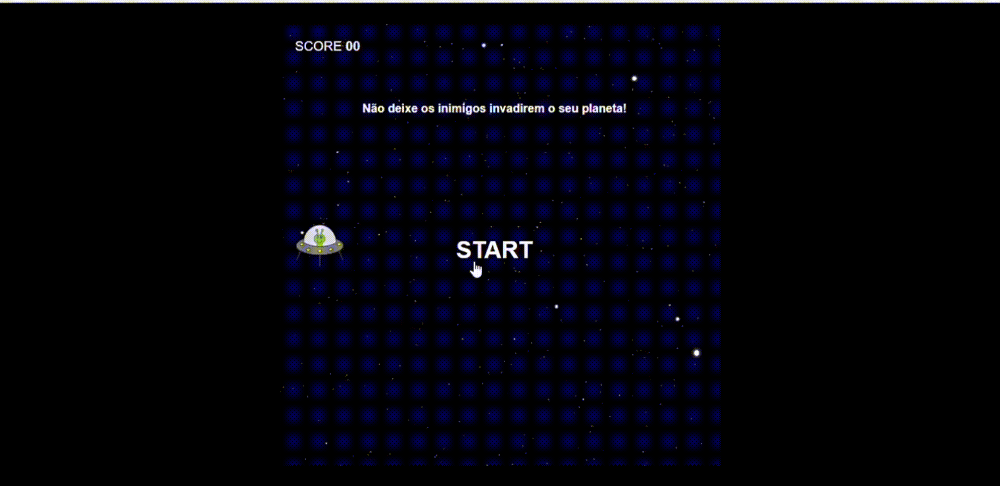

# 🚀 Criando seu próprio Jogo estilo Space Shooter - DIO

[Preview](https://github.com/PatriciaRodriguesR/DIO-Jogo-Estilo-Space-Shooter#%EF%B8%8F%EF%B8%8F-preview) • [Description](https://github.com/PatriciaRodriguesR/DIO-Jogo-Estilo-Space-Shooter#%E2%84%B9%EF%B8%8F-description) • [Technologies](https://github.com/PatriciaRodriguesR/DIO-Jogo-Estilo-Space-Shooter#%EF%B8%8F-technologies) • [Tasks](https://github.com/PatriciaRodriguesR/DIO-Jogo-Estilo-Space-Shooter#-tasks) • [License](https://github.com/PatriciaRodriguesR/DIO-Jogo-Estilo-Space-Shooter#-license) • [View Demo](https://PatriciaRodriguesR.github.io/DIO-Jogo-Estilo-Space-Shooter/)

---

## Bootcamp - [Órbi Web Games Developer](https://www.dio.me/bootcamp/orbi-web-game-developer):

### Projeto 4:

## 👁️‍🗨️ Preview

Link para visualizar: [View Demo](https://PatriciaRodriguesR.github.io/DIO-Jogo-Estilo-Space-Shooter/)

### 🖥️ Computer

---

## ℹ️ Description

Repositório do projeto prático proposto na aula do Bootcamp - Órbi Web Games Developer da [DIO](https://www.dio.me/), ministrada pela especialista **Gabriela Pinheiro**, com o desafio de desenvolver um jogo estilo Space Shooter, utilizando HTML, CSS e Javascript, com o objetivo de aperfeiçoamento posicionamento no CSS e lógica de programação utilizando posicionamento com CSS, manipulação do DOM, eventListeners, e manipulação de Array.

---

## 🛠️ **Technologies**

  

---

## 📝 **Tasks**

- [x] Adicionar display com Fim de jogo
- [x] Adicionar pontuação realizada
- [x] Adicionar botão para reiniciar jogo
- [x] Adicionar favicon

---

## 📃 License

This project is under the **MIT license**. See the [LICENSE](https://github.com/PatriciaRodriguesR/DIO-Jogo-Estilo-Genius/blob/master/LICENSE) for more information.

---

Made with 💜 by [**Patrícia Rodrigues**](https://github.com/PatriciaRodriguesR/) 👋

